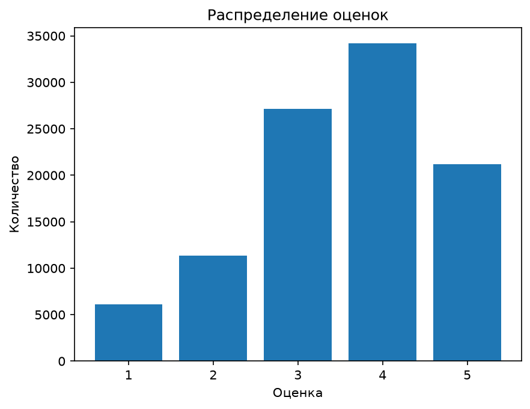
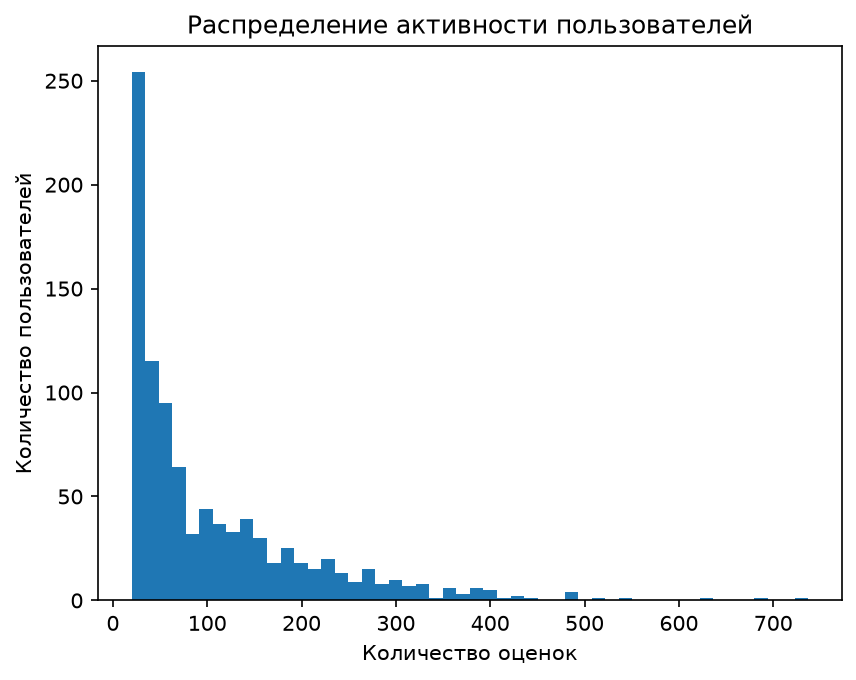
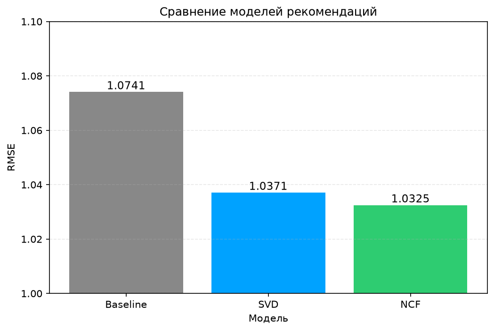

# Movie Recommender System

End-to-end система рекомендаций фильмов: SQL-анализ данных, матричная факторизация и нейросетевой подход. Проект сравнивает три метода предсказания оценок и демонстрирует полный ML-пайплайн — от сырых данных до готовой модели.

## Задача

Даны пользователи и фильмы с историей оценок. Нужно предсказать, какую оценку пользователь поставит фильму, который ещё не смотрел. Это ключевая задача для маркетплейсов и стриминговых платформ: персонализированные рекомендации повышают вовлечённость и удержание пользователей.

## Данные

**MovieLens 100K** — benchmark-датасет от GroupLens Research.

| Метрика | Значение |
|---------|----------|
| Оценок | 100 000 |
| Пользователей | 943 |
| Фильмов | 1 682 |
| Разреженность | ~94% пустых ячеек |

Датасет намеренно разреженный: пользователи оценивают лишь малую часть фильмов, что делает задачу нетривиальной и приближенной к реальным условиям. Исторические оценки разделены **по времени** — последние 20% оценок каждого пользователя образуют тестовую выборку, остальные — обучающую. Такой подход исключает утечку данных и имитирует реальную продакшн-ситуацию.

## Подход

Проект разделён на три этапа.

### 1. Разведочный анализ (SQL)

Все данные загружены в базу SQLite и проанализированы через SQL-запросы. Ключевые находки:

- **Распределение оценок:** пользователи щедрые — оценки 4 и 5 встречаются чаще всего.
- **Активность пользователей:** распределение с длинным хвостом — большинство ставит 20–100 оценок, единицы — 300+.
- **Возрастные группы:** пользователи разбиты на 4 группы (young, middle, adult, senior). В группе senior всего 31 человек, что ограничивает моделирование для этого сегмента.
- **Популярные фильмы:** определены топ-фильмы по каждой возрастной группе с фильтром по минимальному числу оценок.

Полный набор запросов — в папке `sql/`.

### 2. Baseline и матричная факторизация

**Baseline:** предсказание среднего рейтинга каждого фильма. Простая, интерпретируемая модель, задающая нижнюю границу для сравнения.

**SVD (TruncatedSVD):** разложение матрицы «пользователи × фильмы» на латентные эмбеддинги. Пропуски заполнены средним рейтингом фильма, затем матрица центрирована по общему среднему. Число компонент `k` подобрано перебором — `k=10` дал лучший результат, большие значения приводят к переобучению.

### 3. Neural Collaborative Filtering (PyTorch)

Нейросеть заменяет скалярное произведение классической матричной факторизации на многослойный перцептрон. Каждый пользователь и фильм представлены 32-мерным эмбеддингом, которые конкатенируются и проходят через три полносвязных слоя с ReLU. Обучение: Adam, MSE loss, фиксированный random seed для воспроизводимости.

## Результаты

| Модель | RMSE | Улучшение |
|--------|------|-----------|
| Baseline | 1.0741 | — |
| SVD (k=10) | 1.0371 | −3.4% |
| **NCF (seed=42)** | **1.0325** | **−3.9%** |

Нейросетевой подход превосходит и baseline, и матричную факторизацию. Улучшение стабильно воспроизводится с фиксированным seed и подтверждает, что нелинейные взаимодействия между эмбеддингами пользователя и фильма несут дополнительный сигнал для предсказания оценок.

## Визуализации

### Распределение оценок



### Активность пользователей



### Сравнение моделей



## Стек

- **Данные:** SQLite, pandas, NumPy
- **Классический ML:** scikit-learn (TruncatedSVD)
- **Deep Learning:** PyTorch
- **Визуализация:** matplotlib, seaborn
- **Окружение:** Python 3.14

## Структура проекта

```
ml-recommender/
├── data/                      # датасет (не отслеживается)
├── models/                    # сохранённые веса (не отслеживается)
├── notebooks/
│   ├── 01_eda.ipynb           # загрузка данных и SQL-анализ
│   └── 02_models.ipynb        # baseline, SVD, NCF
├── reports/figures/           # графики для README
├── sql/                       # SQL-запросы для EDA
├── .gitignore
└── README.md
```

## Как запустить

```bash
pip install pandas numpy scikit-learn matplotlib seaborn torch
```

Открыть `notebooks/01_eda.ipynb` и `notebooks/02_models.ipynb`, выполнить ячейки последовательно. Первый ноутбук скачивает датасет, строит SQLite-базу и делает EDA. Второй обучает все три модели и выводит итоговое сравнение.

## Автор

**Мадина Тагаева**
- GitHub: [github.com/tagmrr](https://github.com/tagmrr)
- Telegram: @tagmrr